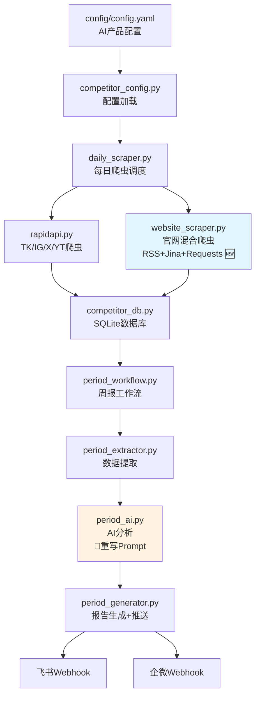

# AI 产品竞品社媒监控 — 改造方案

> **最后更新**: 2026-04-10
> **官网爬虫方案**: 混合方案（RSS 优先 + Jina Reader + Requests 降级），不使用 Playwright

## 一、背景与目标

将当前项目从**游戏竞品社媒监控**改造为**AI 产品竞品社媒监控**。

### 监控对象（来自 CSV）

| 产品 | 官网 | TikTok | Instagram | X | YouTube |
|------|------|--------|-----------|---|---------|
| PixVerse | pixverse.ai | @pixverse | @pixverse_official | @pixverse_ | @PixVerse_Official |
| AI Mirror | aimirror.fun | @aimirror.official | @aimirror.official | @aimirror_app | @AIMirror |
| Glam AI | glamlabs.app | @glam_app | @glam_app | @glam_app | — |
| DreamFace | dreamfaceapp.com | @dreamfaceapp | @dreamface.official | @DreamFaceApp | — |
| Creati | — | @imgcreator.ai | — | @ZMOAI | — |
| SelfyzAI | — | @selfyzai | @selfyzai | @SelfyzAI | — |
| Momo | momoai.co | @momoai.app | @momoai.app | — | — |
| Videa | — | — | — | — | — |
| AI Marvels | hitpaw.com | @hitpaw_official | @hitpaw | @HitPawOfficial | @HitPaw |
| Revive | reviveapp.net | — | @revive.app | — | — |
| FacePlay | faceplay.cc | @faceplay_app | @faceplay_official | — | — |
| Hula AI | hulaapp.ai | @hula_ai | @hula_ai | — | — |

### 关键约束

- **TK / IG / X**：已测试，可直接复用 RapidAPI 路径
- **YouTube**：目前无法获取 Shorts 短视频，常规视频可爬
- **官网**：新增平台，使用混合方案抓取内容（RSS 优先 + Jina Reader + Requests 降级）
- **Facebook / LinkedIn**：CSV 中无此类平台，可移除

---

## 二、当前模块可复用性评估

### 数据流总览

```
config.yaml → competitor_config.py → daily_scraper.py → rapidapi.py → competitor_db.py
                                                                      ↓
period_workflow.py → period_extractor.py → period_ai.py → period_generator.py → 飞书/企微
```

### 逐模块评估

| 模块 | 文件 | 可复用性 | 说明 |
|------|------|----------|------|
| **RapidAPI 基础设施** | `scrapers/rapidapi.py` | 🟢 高 | 多 Key 轮换、429/403 重试、请求封装完全通用；TK/IG/X 函数直接复用 |
| **Twitter 爬虫** | `scrapers/rapidapi.py` 内 | 🟢 高 | `get_posts_from_twitter()` 直接复用 |
| **TikTok 爬虫** | `scrapers/rapidapi.py` 内 | 🟢 高 | `get_posts_from_tiktok()` 直接复用 |
| **Instagram 爬虫** | `scrapers/rapidapi.py` 内 | 🟢 高 | `get_posts_from_instagram()` 直接复用 |
| **YouTube 爬虫** | `scrapers/rapidapi.py` 内 | 🟡 中 | 常规视频可爬，Shorts 不可用；保留但标记限制 |
| **Facebook 爬虫** | `scrapers/facebook.py` | 🔴 低 | CSV 无 Facebook 账号，可移除或保留备用 |
| **每日爬虫调度** | `scrapers/daily_scraper.py` | 🟡 中 | 核心调度逻辑可复用，但 game 分支逻辑需移除，需新增 website 平台分支 |
| **配置加载** | `competitor_config.py` | 🟡 中 | YAML 加载通用，但需适配新配置结构（无 games 层级） |
| **数据库** | `database/competitor_db.py` | 🟡 中 | 表结构通用，但 `game_name` 字段需处理；需新增 website 相关字段 |
| **日报 AI** | `analyzers/daily_ai.py` | 🔴 低 | Prompt 全部游戏向（"游戏发行与投放总监"、"UA 创意洞察"、"玩法/机制"），需完全重写 |
| **周报 AI** | `analyzers/period_ai.py` | 🔴 低 | 同上，分析维度（new_gameplay、offline_events）需替换为 AI 产品维度 |
| **数据提取** | `reports/period_extractor.py` | 🟢 高 | 从 DB 按日期提取数据的逻辑通用，仅需调整 game 相关字段 |
| **报告生成** | `reports/period_generator.py` | 🟡 中 | 飞书/企微卡片生成通用，需新增 website 图标、调整分析字段名 |
| **工作流** | `workflows/period_workflow.py` | 🟢 高 | 三步流水线完全通用，几乎无需改动 |
| **环境变量** | `env_loader.py` | 🟢 高 | 无需改动 |

---

## 三、核心架构变更

### 3.1 数据模型：从 公司→游戏→平台 到 产品→平台

**旧模型（游戏竞品）**：
```
Company (Voodoo)
  ├── platforms (公司级: twitter, instagram)
  └── games
       ├── papers.io
       │    └── platforms (tiktok, youtube, instagram)
       └── mob control
            └── platforms (tiktok, instagram, youtube)
```

**新模型（AI 产品）**：
```
Product (PixVerse)
  ├── platforms
  │    ├── tiktok: @pixverse
  │    ├── instagram: @pixverse_official
  │    ├── twitter: @pixverse_
  │    ├── youtube: @PixVerse_Official
  │    └── website: pixverse.ai
```

关键差异：**去掉了 games 层级**，每个 AI 产品直接挂平台。

### 3.2 新增平台：Website（混合爬虫方案）

采用 **三层降级** 策略抓取官网内容，不使用 Playwright：

```
scrapers/website_scraper.py
  ├── 第1层: RSS/Sitemap 探测与解析（零成本、天然增量）
  ├── 第2层: Jina Reader API（网页→Markdown，免费额度）
  ├── 第3层: Requests + BeautifulSoup（基础 HTML 解析降级）
  └── 增量对比（content_hash 检测内容变化）
```

**降级逻辑**：
1. 对每个官网 URL，先探测常见 RSS 路径（`/feed`、`/blog/feed.xml`、`/rss.xml` 等）和 `sitemap.xml`
2. 有 RSS → 直接解析，获取博客/更新条目（天然增量，含发布时间）
3. 无 RSS → 调用 Jina Reader API：`GET https://r.jina.ai/{url}` → 返回结构化 Markdown
4. Jina 失败 → Requests + BeautifulSoup 降级，至少拿到 meta 标签和基础 HTML
5. 对页面核心文本做 MD5 哈希，下次爬取时对比，变化时才记录

### 3.3 AI 分析维度变更

| 旧维度（游戏） | 新维度（AI 产品） |
|----------------|------------------|
| new_gameplay（新玩法） | new_features（新功能/新模型） |
| offline_events（线下活动） | product_updates（产品更新/版本发布） |
| ad_creative_insights（UA 创意洞察） | marketing_insights（营销/增长洞察） |
| gameplay_or_mechanic_insights | ai_capability_insights（AI 能力洞察） |
| routine_note（日常维护） | routine_note（日常运营） |
| direct_action_suggestions | direct_action_suggestions（保留） |

---

## 四、详细改造步骤

### Phase 1：配置与数据模型改造

#### 1.1 重写 `config/config.yaml`

```yaml
notification:
  webhooks:
    feishu_url: ''
    wework_url: ''
    wework_msg_type: markdown

competitors:
- name: PixVerse
  priority: high
  website_url: https://pixverse.ai
  platforms:
  - username: pixverse
    type: tiktok
    enabled: true
    sec_uid: ''  # 需要填入
  - username: pixverse_official
    type: instagram
    enabled: true
  - username: pixverse_
    type: twitter
    enabled: true
    user_id: ''  # 需要填入
  - username: PixVerse_Official
    type: youtube
    enabled: true
    channel_id: ''  # 需要填入
  - url: https://pixverse.ai
    type: website
    enabled: true

- name: AI Mirror
  priority: high
  website_url: https://aimirror.fun
  platforms:
  - username: aimirror.official
    type: tiktok
    enabled: true
  - username: aimirror.official
    type: instagram
    enabled: true
  - username: aimirror_app
    type: twitter
    enabled: true
  - username: AIMirror
    type: youtube
    enabled: true
  - url: https://aimirror.fun
    type: website
    enabled: true

# ... 其余产品类似
```

#### 1.2 编写 CSV → YAML 转换脚本

创建 `scripts/csv_to_config.py`：
- 读取 CSV 文件
- 自动生成 `config/config.yaml` 的 competitors 部分
- 对 TK/IG/X 自动补全 URL 模板
- 对 website 字段补全 https:// 前缀
- sec_uid / user_id / channel_id 留空待填

#### 1.3 数据库 Schema 迁移

`company_platforms` 表变更：
- `game_name` → `product_name`（或保留字段名但语义变更，存产品名而非游戏名）
- 新增 `website_url` 字段（或复用现有 `url` 字段）
- 新增 `website_content_hash` 字段（用于官网增量对比）

**策略**：保留 `game_name` 字段名但语义变为"产品线/子产品"（对 AI 产品可为空或存产品变体名如 "PixVerse Pro"），避免大规模 Schema 迁移。

### Phase 2：爬虫层改造

#### 2.1 新增 `scrapers/website_scraper.py`

```python
"""
官网内容爬虫模块（混合方案：RSS 优先 + Jina Reader + Requests 降级）
抓取 AI 产品官网的关键信息：产品介绍、功能列表、定价、更新日志等
"""
import hashlib
import feedparser  # RSS 解析
from typing import Dict, List, Any, Optional

# 常见 RSS/Atom 路径，按优先级探测
RSS_CANDIDATE_PATHS = [
    "/feed", "/blog/feed.xml", "/rss.xml", "/feed.xml",
    "/blog/rss", "/blog/feed", "/atom.xml", "/index.xml",
    "/updates/feed", "/news/feed",
]

SITEMAP_CANDIDATE_PATHS = [
    "/sitemap.xml", "/sitemap_index.xml", "/sitemap.txt",
]


def detect_rss(url: str) -> Optional[str]:
    """探测官网是否有 RSS/Atom feed，返回 feed URL 或 None"""
    # 1. 先检查 HTML <link rel="alternate"> 标签
    # 2. 再逐个尝试常见 RSS 路径
    ...


def parse_rss_feed(feed_url: str, days_ago: int = 1) -> Dict[str, Any]:
    """解析 RSS feed，提取最近 N 天的条目"""
    # 使用 feedparser 解析
    # 返回结构化条目列表（标题、链接、摘要、发布时间）
    ...


def scrape_via_jina_reader(url: str) -> Dict[str, Any]:
    """通过 Jina Reader API 将网页转为 Markdown"""
    # GET https://r.jina.ai/{url}
    # 返回 {title, content_markdown, content_hash}
    ...


def scrape_via_requests(url: str) -> Dict[str, Any]:
    """降级方案：Requests + BeautifulSoup 基础 HTML 解析"""
    # 提取 meta 标签、h1/h2、可见文本
    # 返回 {title, description, headings, text_content, content_hash}
    ...


def scrape_website_content(
    url: str,
    days_ago: int = 1,
    content_hash_previous: Optional[str] = None,
) -> Dict[str, Any]:
    """
    混合方案抓取官网内容（三层降级）
    
    1. 探测 RSS → 有则解析 feed 条目
    2. 无 RSS → Jina Reader API
    3. Jina 失败 → Requests + BeautifulSoup
    
    Returns:
        {
            "url": "...",
            "source_type": "rss" | "jina" | "requests",
            "title": "页面标题",
            "description": "meta description",
            "content_markdown": "Markdown 内容（Jina）",
            "headings": ["h1", "h2", ...],
            "feed_entries": [...],  # RSS 条目（如有）
            "content_hash": "md5",
            "content_changed": True/False,  # 与上次对比
            "scraped_at": "ISO时间"
        }
    """
```

关键设计决策：
- **同步架构**：三层方案全部基于 `requests`，与 `daily_scraper.py` 完全一致，无需 async
- **RSS 优先**：零成本、天然增量（含发布时间）、最轻量
- **Jina Reader**：免费额度足够日常使用，返回结构化 Markdown
- **Requests 降级**：最后兜底，至少拿到 meta 信息
- **内容哈希**：对核心文本做 MD5，对比上次判断是否有变化
- **feedparser 依赖**：轻量 RSS 解析库（~50KB），远比 Playwright 轻

#### 2.2 修改 `scrapers/daily_scraper.py`

- 移除 `game` 参数的硬编码逻辑（`scrape_twitter_platform` 等函数的 `game` 参数改为可选，语义变为"产品线"）
- 在 `scrape_company_platforms_from_db()` 的平台分发中新增 `website` 分支
- 移除 Facebook 分支（或保留但默认 disabled）
- YouTube 分支保留，但注释说明 Shorts 限制

#### 2.3 清理 `scrapers/facebook.py`

- 可选：完全移除（CSV 中无 Facebook）
- 或保留但标记为 deprecated，不在新配置中启用

#### 2.4 `scrapers/rapidapi.py` 调整

- 移除 `get_competitor_accounts()` 中的 game 遍历逻辑
- 保留所有平台爬取函数（TK/IG/X/YT）
- 新增 `website` 到 `RAPIDAPI_HOSTS`（不需要，website 不走 RapidAPI）

### Phase 3：AI 分析层改造

#### 3.1 重写 `analyzers/daily_ai.py` 的 Prompt

**角色设定变更**：
```
旧：你是一个资深的游戏发行与投放总监，专门帮团队做「竞品社媒监控 & UA 创意洞察」
新：你是一个资深的 AI 产品经理与增长专家，专门帮团队做「AI 竞品社媒监控 & 产品洞察」
```

**分析维度变更**：
```
旧：广告创意、玩法/机制、趋势定位
新：产品功能更新、AI 模型/能力、营销策略、用户增长信号
```

**输出 JSON 结构变更**：
```json
{
  "title": "PixVerse - tiktok",
  "company": "PixVerse",
  "platform": "tiktok",
  "url": "...",
  "priority": "high",
  "usability_score": 8,
  "analysis": {
    "summary": "整体动态摘要",
    "new_features": "新功能/新模型描述",
    "marketing_insights": "营销策略洞察",
    "ai_capability_insights": "AI 能力/技术洞察",
    "trend_and_positioning": "趋势与定位",
    "risk_or_warning": "风险信号",
    "direct_action_suggestions": "建议动作",
    "engagement": "互动数据摘要"
  }
}
```

#### 3.2 重写 `analyzers/period_ai.py` 的 Prompt

**周报分析维度变更**：
```json
{
  "company": "PixVerse",
  "weekly_score": 8,
  "weekly_title": "新模型上线 + 定价调整",
  "summary": "整体动态摘要",
  "new_features": "新功能/新模型（或'无'）",
  "new_features_post_urls": [],
  "product_updates": "产品更新/版本发布（或'无'）",
  "product_updates_post_urls": [],
  "routine_note": "日常运营说明",
  "direct_action_suggestions": "建议动作"
}
```

### Phase 4：报告层改造

#### 4.1 修改 `reports/period_generator.py`

- 新增 `website` 平台图标（🌐）
- 调整飞书卡片中的分析字段名（new_gameplay → new_features 等）
- 移除 game 相关的显示逻辑

#### 4.2 修改 `reports/period_extractor.py`

- 调整 game_name 字段的处理逻辑（保留字段但语义变更）

### Phase 5：依赖与部署

#### 5.1 新增依赖

```
# requirements.txt 新增
feedparser>=6.0.0    # RSS/Atom 解析（~50KB，极轻量）
beautifulsoup4>=4.12.0  # HTML 解析降级方案
```

无需安装 Chromium 或任何浏览器，Docker 镜像体积几乎不变。

#### 5.2 `.env` 新增变量

```
# Jina Reader API（可选，免费额度通常够用）
JINA_READER_API_KEY=     # 留空则使用免费额度
```

---

## 五、改造后的系统架构



---

## 六、实施步骤清单

### Phase 1：配置与数据模型
- [ ] 编写 `scripts/csv_to_config.py`，将 CSV 自动转换为 config.yaml
- [ ] 重写 `config/config.yaml`，填入 11 个 AI 产品的配置
- [ ] 修改 `competitor_config.py`，适配新配置结构（移除 games 层级遍历）
- [ ] 数据库 Schema 兼容处理：`game_name` 字段语义变更文档化

### Phase 2：爬虫层
- [ ] 新建 `scrapers/website_scraper.py`（混合方案：RSS + Jina Reader + Requests）
- [ ] 修改 `scrapers/daily_scraper.py`：新增 website 平台分支、移除 game 硬编码
- [ ] 修改 `scrapers/rapidapi.py`：清理 game 相关逻辑
- [ ] 移除或标记 deprecated `scrapers/facebook.py`
- [ ] 更新 `requirements.txt` 添加 feedparser、beautifulsoup4 依赖

### Phase 3：AI 分析层
- [ ] 重写 `analyzers/daily_ai.py` 的 Prompt（AI 产品视角）
- [ ] 重写 `analyzers/period_ai.py` 的 Prompt 和分析维度
- [ ] 更新输出 JSON 结构定义

### Phase 4：报告层
- [ ] 修改 `reports/period_generator.py`：新增 website 图标、调整字段名
- [ ] 修改 `reports/period_extractor.py`：调整 game_name 处理

### Phase 5：测试与部署
- [ ] 端到端测试：每日爬虫（TK/IG/X/YT/Website）
- [ ] 端到端测试：周报工作流
- [ ] 更新 README.md
- [ ] 清理旧数据库或迁移

---

## 七、风险与注意事项

1. **Jina Reader 免费额度**：免费版有请求频率限制（~20次/分钟），11 个产品每日一次足够；如超限可加 API Key
2. **官网结构差异大**：每个 AI 产品官网结构不同，Requests 降级方案可能拿不到完整内容，但 Jina Reader 通常能处理
3. **RSS 覆盖率不确定**：部分 AI 产品可能没有 RSS，需逐个探测；有 RSS 的效果最好
4. **JS 渲染页面**：Requests + BeautifulSoup 无法渲染 JS，但 Jina Reader 服务端渲染可覆盖大部分场景
5. **YouTube Shorts 限制**：当前 RapidAPI 方案无法获取 Shorts，如需监控需寻找替代方案
6. **sec_uid / user_id / channel_id 缺失**：CSV 中只有 username，首次运行时需自动解析或手动填入
7. **数据库兼容**：旧数据库中有游戏竞品数据，建议新建数据库或清空后重新开始
